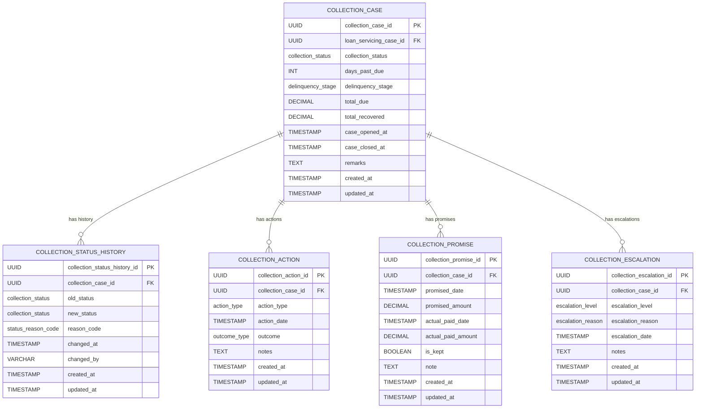

# Core Lending Delinquency & Collections Service

[](https://opensource.org/licenses/Apache-2.0)
[](https://openjdk.java.net/projects/jdk/21/)
[](https://spring.io/projects/spring-boot)

## Overview

The **Core Lending Delinquency & Collections Service** is a critical microservice component of the **Firefly OpenCore Banking Platform**, developed by [Firefly Software Solutions Inc](https://getfirefly.io) under the Apache 2.0 license. This service provides comprehensive loan delinquency management and collections processing capabilities for financial institutions.

### Key Features

- **Delinquency Case Management**: Track and manage delinquent loan accounts with comprehensive case lifecycle management
- **Collection Actions**: Record and track various collection activities (calls, emails, visits, legal notices)
- **Payment Promises**: Manage borrower payment commitments and track fulfillment
- **Escalation Management**: Handle case escalations through different levels and departments
- **Status History**: Maintain complete audit trails of case status changes
- **Reactive Architecture**: Built with Spring WebFlux for high-performance, non-blocking operations

## Architecture

### Multi-Module Structure

This service follows a clean architecture pattern with the following Maven modules:

#### 1. **core-lending-delinquency-collections-interfaces**
- **Purpose**: API contracts and data transfer objects
- **Contains**:
  - DTOs (Data Transfer Objects) with validation annotations
  - Enums for business constants
  - Service interfaces
  - API specifications

#### 2. **core-lending-delinquency-collections-models**
- **Purpose**: Data persistence layer
- **Contains**:
  - JPA/R2DBC entity definitions
  - Repository interfaces
  - Database migration scripts (Flyway)
  - Database configuration

#### 3. **core-lending-delinquency-collections-core**
- **Purpose**: Business logic implementation
- **Contains**:
  - Service implementations
  - Entity-DTO mappers
  - Business rules and validations
  - Core processing logic

#### 4. **core-lending-delinquency-collections-web**
- **Purpose**: REST API layer and application bootstrap
- **Contains**:
  - REST controllers
  - Application main class
  - Web configuration
  - OpenAPI documentation

#### 5. **core-lending-delinquency-collections-sdk**
- **Purpose**: Client SDK and API specifications
- **Contains**:
  - OpenAPI specifications
  - Client generation artifacts
  - API documentation

### Technology Stack

| Component | Technology | Version |
|-----------|------------|---------|
| **Language** | Java | 21 (with Virtual Threads) |
| **Framework** | Spring Boot | 3.x |
| **Web Layer** | Spring WebFlux | Reactive |
| **Data Access** | Spring Data R2DBC | Reactive |
| **Database** | PostgreSQL | 14+ |
| **Migration** | Flyway | Latest |
| **Documentation** | OpenAPI/Swagger | 3.0 |
| **Build Tool** | Maven | 3.8+ |
| **Validation** | Jakarta Validation | Bean Validation 3.0 |
| **Monitoring** | Spring Actuator + Micrometer | Prometheus metrics |

## Database Schema

### Entity Relationship Diagram



### Enumerations

#### Collection Status
- `OPEN` - Active collection case
- `CLOSED` - Case resolved/closed
- `LEGAL` - Referred to legal department
- `RESTRUCTURED` - Loan restructured
- `SETTLED` - Settlement reached

#### Delinquency Stage
- `EARLY` - Early delinquency (1-30 days)
- `MID` - Mid delinquency (31-60 days)
- `LATE` - Late delinquency (61-90 days)
- `LEGAL` - Legal action stage (90+ days)
- `WRITE_OFF` - Written off

#### Action Types
- `PHONE_CALL` - Phone contact attempt
- `SMS` - SMS message sent
- `EMAIL` - Email communication
- `VISIT` - Physical visit
- `LEGAL_NOTICE` - Legal notice sent
- `DEMAND_LETTER` - Demand letter sent

#### Outcome Types
- `NO_ANSWER` - No response received
- `PROMISE_TO_PAY` - Payment promise made
- `PAID_PARTIAL` - Partial payment received
- `REFUSED` - Payment refused
- `DISPUTED` - Debt disputed

#### Escalation Levels
- `LEVEL_1` - First level escalation
- `LEVEL_2` - Second level escalation
- `LEVEL_3` - Third level escalation
- `LEGAL` - Legal department
- `EXTERNAL` - External agency

#### Status Reason Codes
- `PROMISE_BROKEN` - Payment promise not kept
- `LEGAL_REFERRAL` - Referred to legal
- `PAYMENT_RECEIVED` - Payment received
- `NO_CONTACT` - Unable to contact borrower

#### Escalation Reasons
- `BROKEN_PROMISE` - Broken payment promise
- `NO_CONTACT` - No contact established
- `HIGH_AMOUNT` - High debt amount
- `FRAUD_SUSPECT` - Suspected fraud

## Getting Started

### Prerequisites

- **Java 21+** - Required for virtual threads support
- **Maven 3.8+** - Build tool
- **PostgreSQL 14+** - Database server
- **Docker** (optional) - For containerized deployment

### Environment Configuration

Set the following environment variables:

```bash
# Database Configuration
DB_HOST=localhost
DB_PORT=5432
DB_NAME=collections_db
DB_USERNAME=postgres
DB_PASSWORD=your_password
DB_SSL_MODE=disable

# Application Configuration
SERVER_ADDRESS=localhost
SERVER_PORT=8080
```

### Quick Start

1. **Clone the repository**:
   ```bash
   git clone https://github.com/firefly-oss/core-lending-delinquency-collections.git
   cd core-lending-delinquency-collections
   ```

2. **Build the application**:
   ```bash
   mvn clean install
   ```

3. **Run the application**:
   ```bash
   # Using Maven
   mvn spring-boot:run -pl core-lending-delinquency-collections-web

   # Using JAR
   java -jar core-lending-delinquency-collections-web/target/core-lending-delinquency-collections-web-1.0.0-SNAPSHOT.jar
   ```

4. **Access the API documentation**:
   - Swagger UI: http://localhost:8080/swagger-ui.html
   - OpenAPI Spec: http://localhost:8080/v3/api-docs

### Docker Deployment

```bash
# Build Docker image
docker build -t firefly/core-lending-delinquency-collections .

# Run with Docker Compose (recommended)
docker-compose up -d

# Or run standalone
docker run -p 8080:8080 \
  -e DB_HOST=host.docker.internal \
  -e DB_PORT=5432 \
  -e DB_NAME=collections_db \
  -e DB_USERNAME=postgres \
  -e DB_PASSWORD=your_password \
  firefly/core-lending-delinquency-collections
```

## API Reference

### Base URL
- **Development**: `http://localhost:8080`
- **Production**: `https://api.getfirefly.io/loan-collections`

### Authentication
This service integrates with the Firefly platform's authentication system. Include the JWT token in the Authorization header:

```
Authorization: Bearer <jwt-token>
```

### Core Endpoints

#### Collection Cases
```http
GET    /api/v1/collection-cases                    # List cases with filtering
POST   /api/v1/collection-cases                    # Create new case
GET    /api/v1/collection-cases/{caseId}           # Get case details
PUT    /api/v1/collection-cases/{caseId}           # Update case
DELETE /api/v1/collection-cases/{caseId}           # Delete case
```

#### Collection Actions
```http
GET    /api/v1/collection-cases/{caseId}/actions           # List case actions
POST   /api/v1/collection-cases/{caseId}/actions           # Create action
GET    /api/v1/collection-cases/{caseId}/actions/{actionId} # Get action details
```

#### Collection Promises
```http
GET    /api/v1/collection-cases/{caseId}/promises           # List case promises
POST   /api/v1/collection-cases/{caseId}/promises           # Create promise
PUT    /api/v1/collection-cases/{caseId}/promises/{promiseId} # Update promise
GET    /api/v1/collection-cases/{caseId}/promises/{promiseId} # Get promise details
```

#### Collection Escalations
```http
GET    /api/v1/collection-cases/{caseId}/escalations           # List case escalations
POST   /api/v1/collection-cases/{caseId}/escalations           # Create escalation
GET    /api/v1/collection-cases/{caseId}/escalations/{escalationId} # Get escalation details
```

#### Status History
```http
GET    /api/v1/collection-cases/{caseId}/status-history       # List status changes
POST   /api/v1/collection-cases/{caseId}/status-history       # Record status change
GET    /api/v1/collection-cases/{caseId}/status-history/{historyId} # Get status change details
```

### Request/Response Examples

#### Create Collection Case
```json
POST /api/v1/collection-cases
{
  "loanServicingCaseId": "123e4567-e89b-12d3-a456-426614174000",
  "collectionStatus": "OPEN",
  "daysPastDue": 45,
  "delinquencyStage": "MID",
  "totalDue": 5000.00,
  "totalRecovered": 0.00,
  "caseOpenedAt": "2024-01-15T10:30:00Z",
  "remarks": "Initial collection case creation"
}
```

#### Create Collection Action
```json
POST /api/v1/collection-cases/{caseId}/actions
{
  "actionType": "PHONE_CALL",
  "actionDate": "2024-01-16T14:30:00Z",
  "outcome": "PROMISE_TO_PAY",
  "notes": "Borrower promised to pay $1000 by end of week"
}
```

### Error Handling

The API uses standard HTTP status codes and returns detailed error information:

```json
{
  "timestamp": "2024-01-16T10:30:00Z",
  "status": 400,
  "error": "Bad Request",
  "message": "Validation failed",
  "path": "/api/v1/collection-cases",
  "details": [
    {
      "field": "daysPastDue",
      "message": "Days past due must be non-negative"
    }
  ]
}
```

## Development Guide

### Project Structure

```
core-lending-delinquency-collections/
├── core-lending-delinquency-collections-interfaces/
│   └── src/main/java/com/firefly/core/lending/collections/interfaces/
│       ├── dtos/           # Data Transfer Objects
│       ├── enums/          # Business enumerations
│       └── services/       # Service interfaces
├── core-lending-delinquency-collections-models/
│   └── src/main/java/com/firefly/core/lending/collections/models/
│       ├── entities/       # JPA entities
│       ├── repositories/   # Repository interfaces
│       └── resources/db/migration/  # Flyway migrations
├── core-lending-delinquency-collections-core/
│   └── src/main/java/com/firefly/core/lending/collections/core/
│       ├── services/       # Service implementations
│       └── mappers/        # Entity-DTO mappers
├── core-lending-delinquency-collections-web/
│   └── src/main/java/com/firefly/core/lending/collections/web/
│       ├── controllers/    # REST controllers
│       └── config/         # Web configuration
└── core-lending-delinquency-collections-sdk/
    └── src/main/resources/api-spec/  # OpenAPI specifications
```

### Coding Standards

- **Package Naming**: Follow the pattern `com.firefly.core.lending.collections.{module}.{feature}.{version}`
- **Versioning**: Use `v1`, `v2` packages for API versioning
- **Reactive Programming**: Use `Mono<T>` for single values, `Flux<T>` for streams
- **Validation**: Use Jakarta Validation annotations on DTOs
- **Error Handling**: Use reactive error handling with `onErrorMap()` and `onErrorReturn()`

### Testing Strategy

```bash
# Run all tests
mvn test

# Run integration tests
mvn verify

# Run specific test class
mvn test -Dtest=CollectionCaseServiceTest

# Generate test coverage report
mvn jacoco:report
```

### Database Migrations

Flyway migrations are located in `core-lending-delinquency-collections-models/src/main/resources/db/migration/`:

- `V1__Create_Enums.sql` - Database enumerations
- `V2__Create_Tables.sql` - Core tables and relationships
- `V3__Create_Indexes.sql` - Performance indexes

### Configuration Profiles

| Profile | Purpose | Features |
|---------|---------|----------|
| `dev` | Development | Debug logging, H2 console, detailed error messages |
| `testing` | Testing | API docs enabled, test database |
| `prod` | Production | Minimal logging, security headers, metrics |

## Monitoring & Observability

### Health Checks

The service exposes comprehensive health checks:

```bash
# Overall health
curl http://localhost:8080/actuator/health

# Database connectivity
curl http://localhost:8080/actuator/health/db

# Readiness probe
curl http://localhost:8080/actuator/health/readiness

# Liveness probe
curl http://localhost:8080/actuator/health/liveness
```

### Metrics

Prometheus metrics are available at `/actuator/prometheus`:

- **Business Metrics**: Collection case counts, action types, escalation rates
- **Technical Metrics**: HTTP request rates, database connection pools, JVM metrics
- **Custom Metrics**: Delinquency stage distributions, recovery rates

### Logging

Structured logging with correlation IDs for request tracing:

```json
{
  "timestamp": "2024-01-16T10:30:00.123Z",
  "level": "INFO",
  "logger": "com.firefly.core.lending.collections.core.services.cases.v1.CollectionCaseServiceImpl",
  "message": "Collection case created successfully",
  "correlationId": "abc123-def456",
  "caseId": "123e4567-e89b-12d3-a456-426614174000"
}
```

## Contributing

We welcome contributions to the Firefly OpenCore Banking Platform! Please see our [Contributing Guidelines](CONTRIBUTING.md) for details.

### Development Workflow

1. Fork the repository
2. Create a feature branch: `git checkout -b feature/your-feature-name`
3. Make your changes following our coding standards
4. Add tests for new functionality
5. Run the test suite: `mvn test`
6. Submit a pull request

### Code Review Process

All changes must go through code review:
- Automated CI/CD checks must pass
- At least one maintainer approval required
- All tests must pass
- Documentation must be updated

## License

This project is licensed under the Apache License 2.0 - see the [LICENSE](LICENSE) file for details.

## Support & Community

- **Website**: [getfirefly.io](https://getfirefly.io)
- **GitHub Organization**: [firefly-oss](https://github.com/firefly-oss)
- **Documentation**: [docs.getfirefly.io](https://docs.getfirefly.io)
- **Issues**: [GitHub Issues](https://github.com/firefly-oss/core-lending-delinquency-collections/issues)
- **Discussions**: [GitHub Discussions](https://github.com/firefly-oss/core-lending-delinquency-collections/discussions)

## Acknowledgments

Built with ❤️ by the Firefly Software Solutions Inc team and the open-source community.

---

**Firefly OpenCore Banking Platform** - Empowering the future of banking technology.